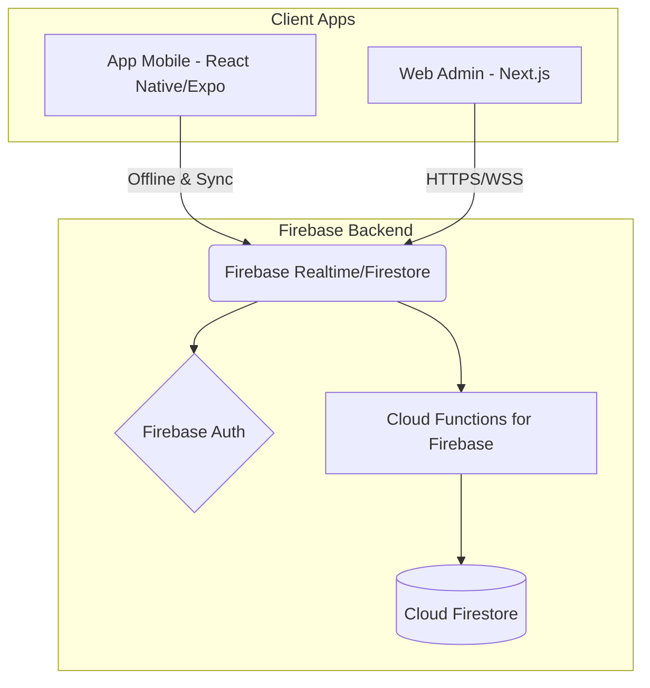

# Arquitetura do Sistema - Minha Fazenda

## Diagrama de Arquitetura

## Stack Escolhida e Justificativa
Priorizamos a stack Firebase + Vercel (Next.js) + Expo por garantir tempo rápido de mercado, alta compatibilidade entre si e camadas de uso gratuito generosas (Spark Plan).

* **Mobile**: React Native com Expo. 
  * *Justificativa*: Permite construir para Android e iOS com uma base de código (TypeScript). Possui excelente bibliotecas robustas (como WatermelonDB ou o próprio Firestore SDK) para construir o modo **Offline-First**.
* **Web Admin**: Next.js com Tailwind CSS + Radix UI (Shadcn UI).
  * *Justificativa*: React server-sided/client-sided. Extremamente ágil de montar dashboards com componentes visuais atraentes, garantindo o feel premium/gamificado pedido pela visão. Vercel oferece deploy free.
* **Banco de Dados**: Cloud Firestore.
  * *Justificativa*: Sincronização em tempo real nativa, ótimo suporte para offline em dispositivos móveis, e escala gratuitamente no plano Spark.
* **Autenticação**: Firebase Authentication.
  * *Justificativa*: O fluxo de autenticação (Email/Senha e Phone) já possui telas e integrações nativas, poupando tempo de desenvolvimento.
* **Hospedagem (Backend/Web)**: Firebase Hosting (para o App) e Vercel (para o Next.js Web Admin) ou Firebase Hosting para ambos.

## Fluxo de Dados Principal
1. O peão, no pasto sem internet, adiciona uma "Vacinação" para o "Lote A".
2. O Expo App salva localmente a transação no SQLite ou IndexedDB (Firestore cache).
3. Ao retornar para o Wi-Fi da sede, o listener de rede percebe a conexão e envia a mutação para o Firestore via SDK.
4. O Firestore dispara um trigger no Cloud Functions (se necessário processar estoque).
5. O Web Admin Next.js, com listener ativo (`onSnapshot`), reflete o novo saldo de estoque e vacinas dadas na tela do gerente instantaneamente.
